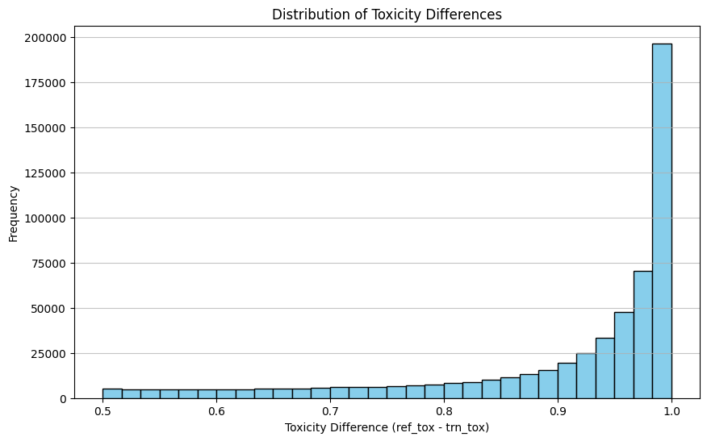
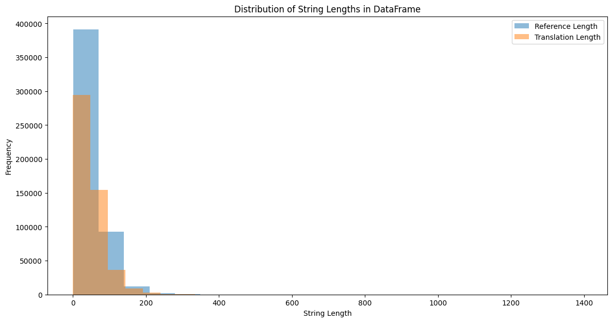
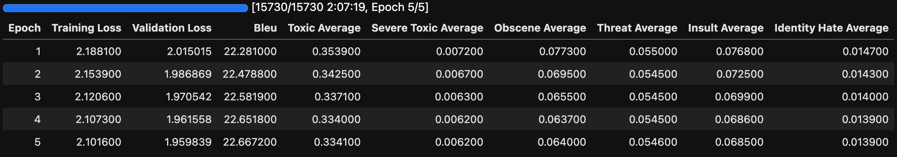

# Report 2: Solution

## Introduction
The aim of this report is to document the comprehensive process undertaken to create a model capable of evaluating and mitigating toxicity in text data. It outlines the journey from initial data analysis and model specification to the training procedures and the ultimate evaluation of model performance. This narrative serves to detail the challenges encountered, the solutions implemented, and the results achieved in the quest to build an AI system that not only detects toxic language but also suggests non-toxic alternatives, thereby contributing to safer and more respectful online interactions.
## Data analysis
First of all, I cleared the data, checked for NaNs and removed duplicates. Then, I removed all character that were not alphanumerical or commas or full stops. I didn't lowercase the text and remove commas and full stops because I wanted my model to understand how to write proper sentences instead of just outputting lowercased words. 
Secondly, I checked the data distribution and made sure that all the data was in the right ranges (toxicity levels ranging from 0 to 1, no negative values, etc.).  
Thirdly, I checked the correlation between numerical columns and saw low correlation in the `length_diff` and `similarity` columns. As the correlation was low, and I was aiming to use a text to text model anyway, I dropped this columns. Also, I swapped the columns to make sure that the `reference` column always had bigger toxicity levels than the `translation` column.  
The next step was to remove data that I could not use, like rows where the difference between the translation and reference is small or the ones where the toxicity levels are close to 0.5, because these values are useless, as these neutral values can't really be used by the model to understand the relationship between toxic texts and non-toxic ones.  And so, I decided to remove all the rows, where the difference between toxicity levels was smaller than 0.7.  
A very important step was to decide on the max length of the strings I would be using, and I decided to take a look at how long the texts are:  And by looking at the graph, I decided to drop all rows that had texts longer than 256 characters. 
Lastly, I saved the data, removed NaNs once again and proceeded to training the model.
## Model Specification
I used a T5-small model from HuggingFace in the final implementation, using unitary/toxic-bert to evaluate how toxic the output is.
## Training Process
I picked 5 epochs because it provided the optimal trade-off between accuracy and training time. Here are the results of the training process:  As we can see, the improvement in BLEU score was diminishing as the epochs went by, indicating the limitations of the used model. Thanks to unitary/toxic-bert, we can see how the toxicity scores decreased as the model got better and better. I used a `learning_rate=2e-5` and a `weight_decay=0.01` hyperparameters as they were the most promising ones from a sanity test I performed on my local machine. Also, I chose a `batch_size=128` as it was the biggest size my machine could run before running out of memory.
## Evaluation
To evaluate the model, I used the BLEU metric and a unitary/toxic-bert implementation to estimate how toxic the generated text is. Also, I tested the model by asking it to detoxify my prompts, and it was very successful in doing so. You can check it for yourself by running the [predict.sh](../predict.sh) script.
## Conclusion
The T5 model emerged as the most suitable solution, balancing computational demands and performance. It showed proficiency in detoxifying input text while maintaining the context and meaning. However, attempts to push the boundaries with the LLaMa 2 Quantized Model and prompt engineering were constrained by computational resources and built-in ethical safeguards against generating toxic content. Overall, the project illustrated the complexity of handling text toxicity and the importance of utilizing robust, pre-trained models to achieve reliable and ethically responsible outcomes.

> Thanks for the assignment, I had great fun tackling the challenges:)